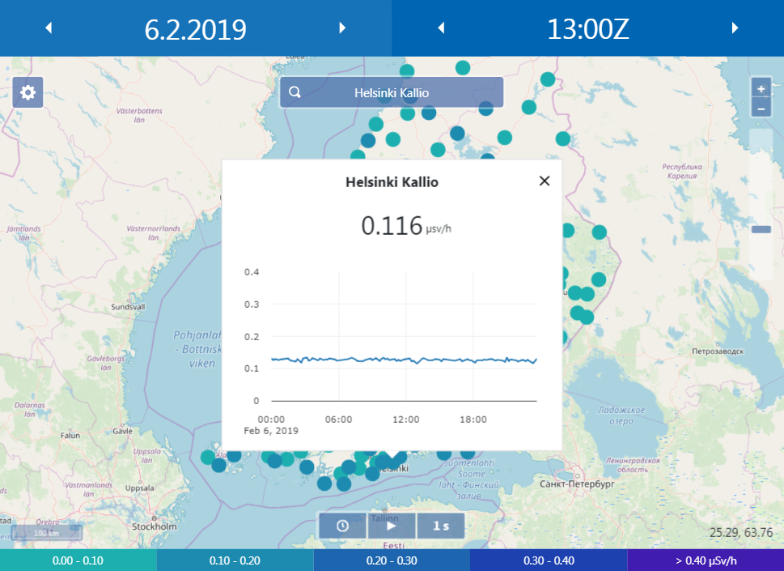

# STUK Open Data Website

An independent web application for viewing external radiation results from [the Finnish Radiation and Nuclear Safety Authority's (STUK)](https://www.stuk.fi/web/en) monitoring network. The application gets its data from [the Finnish Meteorological Institute's (FMI) open data API](https://en.ilmatieteenlaitos.fi/open-data). STUK's publicly hosted version of the project is available at TBA.

The project's documentation is split in three chapters:

1. Usage
2. Hosting
3. Development

The first chapter covers the web application's features and usage from the viewpoint of a regular user. The second chapter goes through the process of hosting the application locally or on a remote server. The third and final chapter provides the necessary information for customizing or further developing the project.

## 1. Usage

The application enables viewing of external radiation results from STUK's monitoring network. It is usable on a variety of devices and display sizes from mobile phones and tablets to desktop computers. Some features may however be unavailable on smaller displays and touchscreens. 

Results are available in increments of 10 minutes. Each result dataset records the average dose rates measured over the last measurement period. The application uses data local to the server it is hosted on. This means that only data already fetched by the host is available for viewing. Consequently, results for certain dates or times could be missing or there might be gaps in the data.

Each point on the map represents a single measurement site. A point's color corresponds to the measured dose rate. Hovering a mouse cursor over a point opens a popup showing the site's name and dose rate. Clicking a point opens a larger popup which also shows a time series graph. 

The graph supports multiple ways of interaction: panning, scrolling, and clicking. Data is by default displayed for the selected date. Panning the graph horizontally causes it to load in and display data for additional dates. Both axes and the graph area can be interacted with by scrolling a mouse wheel. These actions take into account the position of the cursor over the element. Double-clicking the axes or the graph area manipulate how the graph is displayed. Shift-clicking and dragging can be used to zoom in on certain sections of the graph both horizontally and vertically.

Dose rate ranges, colors, and the unit of measurement (e.g. microsievert) are visible in the map legend located at the bottom of the screen. Measurement sites displayed on the map can be filtered by dose rate by clicking the dose rate ranges on the map legend.

The map displays a result dataset for a certain date and time. Both are individually selectable and are visible at the top of the screen. Clicking the date opens a calendar, and clicking the time opens a list. Only dates and times for which data is available are selectable. The arrows next to the date and time can be clicked to increment or decrement the selected date and time.

The application also comes with a set of basic media controls located at the bottom of the screen. They allow the displayed result dataset to be changed automatically by incrementing the selected date or time. The middle button toggles playback on and off, the leftmost button determines whether date or time is incremented, and the rightmost button controls how frequently a new dataset is loaded.

## 2. Hosting

This chapter provides information on hosting the project: building the application, setting it up on a web server, and getting data.

### 2.1 Setting up a server

Hosting the application should be as easy as building it and having a web server point to the 'dist' directory. Refer to chapter 3.1 for instructions on how to build the application. To locally test the project you can use for example the [Web Server for Chrome -plugin](https://chrome.google.com/webstore/detail/web-server-for-chrome/ofhbbkphhbklhfoeikjpcbhemlocgigb?hl=en). For publicly hosting the application refer to your web server of choice's documentation. 

The application by default gets its map tiles from OpenStreetMap's public servers. This is fine for private or light development use, but is forbidden when distributing an application. If you are to host this project publicly, you should configure the application to use local tiles or use a service that allows its use in distributed applications. STUK's own publicly hosted version of this project is configured to use local map tiles.

### 2.2 Getting data

The application does not contain any data by default. Data must be fetched and processed by manually running or scheduling scripts in the 'dist/scripts' directory. The following dependencies are required to run the scripts: Python 3, and the [Requests](https://github.com/requests/requests) Python library, which can be installed by e.g. running 'pip3 install requests'.

The primary script for getting data is the "get_data.py" script. For technical instructions run "get_data.py --help". The script has one required argument for the type of data to get. The only data type currently relevant to the application is "dose_rates". Running the script without any other arguments would fetch a dataset of the most recent measurements. The script can also be used to fetch multiple datasets of old data by providing a timespan. The timespan argument takes a start time and an end time, and fetches all datasets in between.

The application can be kept up-to-date with the most recent results by scheduling the "get_data.py" script. This can be done with e.g. crontab on Linux or Task Scheduler on Windows. The following crontab configuration would run the script every 10 minutes: `*/10 * * * * cd /var/www/html/opendata/scripts/; /bin/python3 /var/www/html/opendata/scripts/get_data.py dose_rates`. Note the changing of directory to the 'scripts' directory. This is done to ensure that relative paths in the scripts point to the correct place.

Every time a new dataset is loaded, time series data for the date to which the dataset belongs to has to be regenerated for it to be up-to-date. The "get_data.py" script performs this automatically, but the action can be performed manually if required by running the script "time_series.py". Another operation performed automatically is the generation of metadata regarding the available datasets. The metadata is used by the client-side to determine which dates and times are selectable. It can be updated manually by running the script "metadata.py".

*Optional: Authenticated FMI API requests*

If you wish to use authenticated API requests when fetching data from FMI's open data portal, an API key must be used. Follow the instructions at  http://en.ilmatieteenlaitos.fi/open-data-manual to register for an API key. Once you have an API key, create a copy of the file 'server-settings.example.json' in the 'dist' directory and name it 'server-settings.json'. In the settings file, replace the FMI API key with your own. When fetching data with the 'get_data.py' script, use the '-a' or '--auth' argument to enable authentication.

## 3. Development

This chapter covers development related topics, such as building the application, the tools and dependencies used by the application, and technical details.

### 3.1 Building the application

1. Clone the repository.

2. Install [node.js](https://nodejs.org) which includes npm (node package manager).

3. Install the project's dependencies by running 'npm install' in the project's root directory.

4. Build the project for production by running 'npm run build' in the project's root directory. During development the project is built with 'npm run dev'. This causes the project's files to be monitored and the project to be automatically rebuilt when changes are detected. The project is built in the 'dist' directory.

### 3.2 Libraries and tools

The project uses the [node package manager (npm)](https://www.npmjs.com) for managing dependencies. Development and application dependencies are listed in the file 'package.json', which is managed by npm. A build tool called [webpack](https://webpack.js.org) is used to perform various build operations, such as bundling and minifying files.

The application's most notable dependencies are [OpenLayers](https://openlayers.org) for mapping, [plotly.js](https://plot.ly/javascript) for graphing, and [Vue.js](https://vuejs.org) as the JavaScript framework.

### 3.3 Technical details

Browsers that are known to *not* work: Internet Explorer.

Python version 3.

NodeJS version 8 or newer.